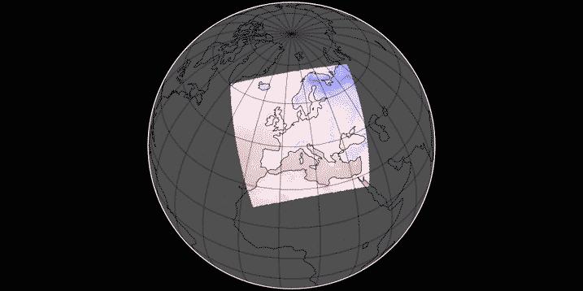

# A wound in time and space

[Open.](https://woundintimeand.space/)

Peering into future climate using [CORDEX regional climate model data on single levels](https://cds.climate.copernicus.eu/cdsapp#!/dataset/projections-cordex-domains-single-levels?tab=doc). Visualisation of Near-Surface Air Temperature for the year 2100 following a RCP 8.5 scenario. Plotted with [Panoply](https://www.giss.nasa.gov/tools/panoply/). Dithered with [imagemagick](https://imagemagick.org/index.php).

## Documentation

Imagemagick command:

    convert -resize 70% -delay 10   -loop 0 rcp_*.png -dither FloydSteinberg  -colors 8  colors_8_rm.gif
